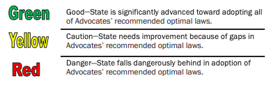

# Chicago, IL : Car Crash Analysis & Predictive Modeling

## *Predicting severity of car crashes with Machine Learning Models*

#### Authors:
[Christos Maglaras](mailto:Christo111M@gmail.com), 
[Marcos Panyagua](mailto:marcosvppfernandes@gmail.com), 
[Jamie Dowat](mailto:jamie_dowat44@yahoo.com)

Date: 3/12/2021

## Contents
* `notebooks`: Contains personal contributor notebooks
* `final_notebook.ipynb` : Contains more detailed analysis and walks through modeling process.
* `src` : Contains source code for `final_notebook.ipynb`.
* `data` : Contains csv files used for modeling (See below for description and links).
* `presentation.pdf` : Slide deck for non-technical presentation

## Data: [Chicago City Data Portal](https://data.cityofchicago.org/)

##### 1. [Crashes](https://data.cityofchicago.org/Transportation/Traffic-Crashes-Crashes/85ca-t3if):

* Number of Rows: 482,866

* *Shows crash data from crash from the Chicago Police Department's **E-Crash** system*

* **"All crashes are recorded as per the format specified in the Traffic Crash Report, SR1050, of the Illinois Department of Transportation."**

##### 2. [People](https://data.cityofchicago.org/Transportation/Traffic-Crashes-People/u6pd-qa9d):

* Number of Rows: 1,068,637

* *Information about people involved in a crash and if any injuries were sustained.*

##### 3. [Vehicles](https://data.cityofchicago.org/Transportation/Traffic-Crashes-Vehicles/68nd-jvt3):

* Number of Rows: 987,148

* *Information about vehicles ("units") involved in a traffic crash.*

*********

## Stakeholder: Chicago Department of Transportation

*Click [here](https://www.chicago.gov/city/en/depts/cdot.html) to check out their website!*

### Business Understanding

Just a week ago, the **National Security Coundil** released a [report](https://www.nsc.org/newsroom/motor-vehicle-deaths-2020-estimated-to-be-highest) containing some disturbing statistics from 2020. The first paragraph begins as follows:
> "For the first time since 2007, preliminary data from the National Safety Council shows that as many as 42,060 people are estimated to have died in motor vehicle crashes in 2020. That marks an 8% increase over 2019 in a year where people drove significantly less frequently because of the pandemic."

According to their data, the US hasn't seen an increase like this since **1924**.

Following this trend, the **Governor's Highway Safety Association** reported that [*pedestrian* fatality rate](https://www.smartcitiesdive.com/news/ghsa-projects-highest-pedestrian-death-rate-since-1988/573203/) has reached a **30-year high**, with nighttime pedestrian fatalities having increased by 67%, and a 16% increase in daytime fatalities, highlighting the need for *safer road crossings* and increased efforts to make pedestrians and vehicles more *visible*.

Narrowing our focus even further, in **Illinois**, around **1000** people were KILLED in motor vehicle crashes in **2019** alone. 

**Advocates for Highway and Auto Safety** have scored all US states against their [Roadmap for State Highway Safety Laws](https://saferoads.org/wp-content/uploads/2020/01/Advocates-for-Highway-and-Auto-Safety-2020-Roadmap-of-State-Highway-Safety-Laws.pdf), a set of 16 laws that cover occupant protection (selt belt, helmet laws), child protection, and teen driving. 

When Illinois is [scored](https://saferoads.org/state/illinois/) against this Roadmap, it has been given a yellow rating (Caution), since it still lacks the following safety laws:

* All-Rider Motorcycle Helmet Law
* Booster Seat Law
* GDL (Graduated Driver's License) – Minimum Age 16 for Learner’s Permit
* GDL – Stronger Nighttime Restriction Provision
* GDL- Stronger Passenger Restriction Provision
* GDL- Age 18 for Unrestricted License

Currently, the Chicago Department of Transportation is working with the city's new initiative, **Vision Zero**, to reduce accidents on the road. In Vision Zero's [report](https://8gq.ef1.myftpupload.com/wp-content/uploads/2016/05/17_0612-VZ-Action-Plan_FOR-WEB.pdf) and action plan, they used crash data to identify high crash corridors in the city as well as other important trends to guide education, road safety improvements, and more.

Bearing all of this in mind, we had these current safety movements and road safety problems guide our exploration and modeling of this data. 

Even more importantly, this business understanding was the sole influencer of our target choice, *severity of crash based on injury*.

******

## Predictive Modeling Preview

In terms of business problems, we found one of the ways a predictive model could most help with this business problem is to determine how different factors of the crash determine the severity of injuries in the crash.

We compared results from *Logistic Regression, K-Nearest Neighbors, Decision Tree, Naive Bayes, and Random Forest Classifier* models, before settling on our final model produced by a **Bayesian-Optimized XGBoost Classifier**.

We experimented with both a BINARY classification and a TERNARY, with our final model using as TERNARY classification. The targets are defined as follows, using the MOST_SEVERE_INJURY column in the Crashes dataset:

* BINARY:
    * Class 0: No Injury
    * Class 1: Injury
    
* TERNARY
    * Class 0: No Injury
    * Class 1: NON-INCAPACITATING injuries
    * Class 2: INCAPACITATING or FATAL injuries

*******

## EDA

#### Showcasing Class Imbalance

*******

## Major Modeling Takeaways

##### 1st Priority Metric: RECALL
*We focused first and foremost on improve RECALL, since the most damaging false predictions would be **false negatives** (predicting no injury, when there was actually injury).*

********
### First Simple Model

**Recall**: 22%

### FINAL MODEL

**Recall**: 84%

#### Top 5 Features - Final Model (by Gain Metric)

* `UNIT_TYPE` - DISABLED VEHICLE (810)
* `DRIVER_ACTION` - DISTRACTION - FROM OUTSIDE VEHICLE (181)
* `PERSON_TYPE` - DRIVER (11)
* `VEHICLE_DEFECT` - ENGINE/MOTOR (8.71)
* `VEHICLE_DEFECT` - WHEELS (8.4)

To access all of our sources, or for more details about our process, see `final_notebook.ipynb` or `presentation.pdf`.

### Repository Structure

├── data  
....├── traffic_crashes_chicago.csv 
....├── traffic_crashes_people.csv 
....└── traffic_crashes_vehicles.csv 
├── img 
....├── cdot.png 
....├── chicago_night_drive.jpg 
....├── chicagocitydataportal.jpg 
....├── finalmodeleltestcm.png 
....├── finalmodeltraincm.png 
....├── scoringsafety.png 
....└── visionzeroquotes.png 
├── notebooks 
....├── Christos_notebook.ipynb 
....├── jamie_notebook.ipynb 
....└── marcos_eda.ipynb 
├── src 
....├── __init__.py 
....├── data_cleaning.py 
....├── eda.py 
....└── models.py 
├──presentation.pdf 
├── final_notebook.ipynb 
└── README.md 